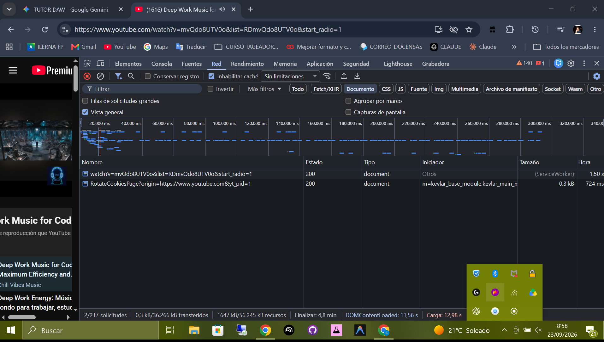
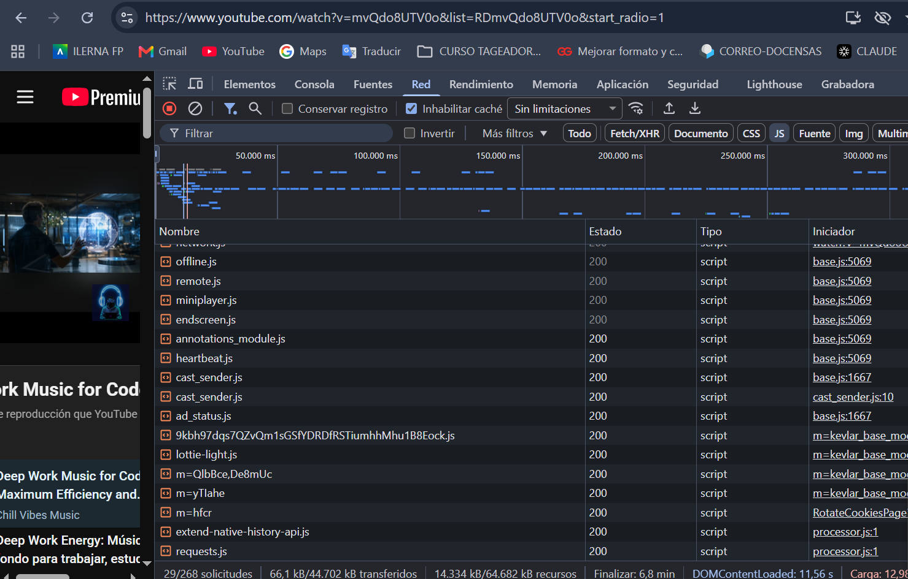
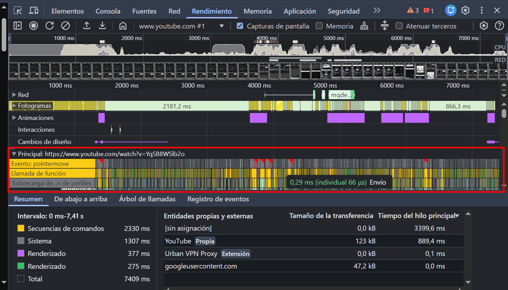
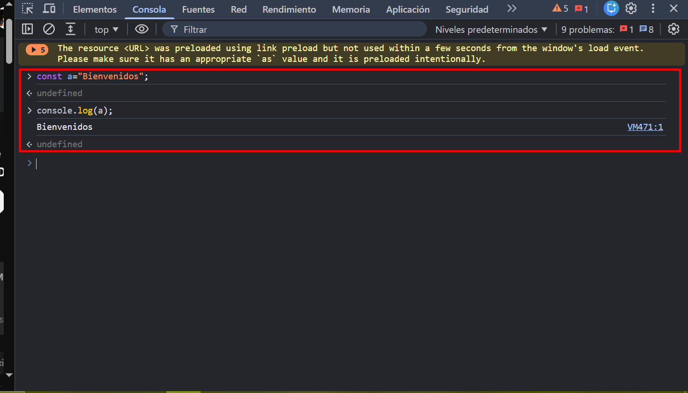
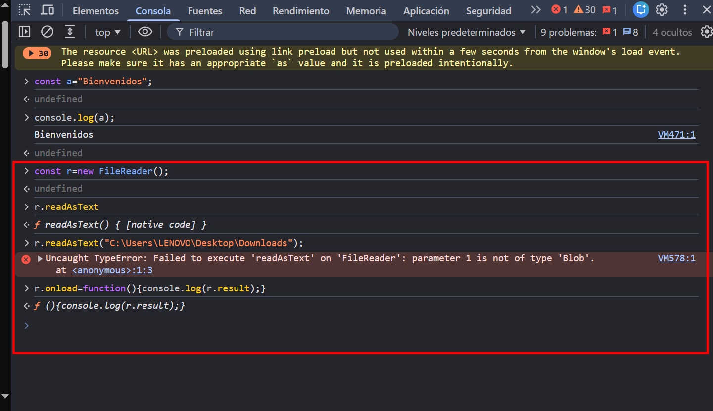
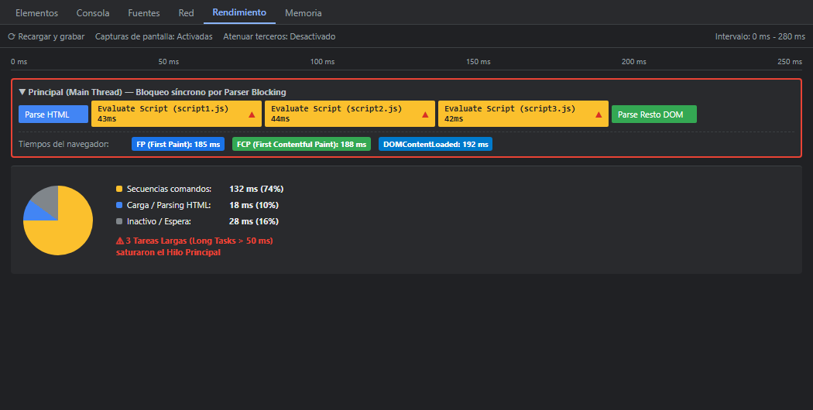
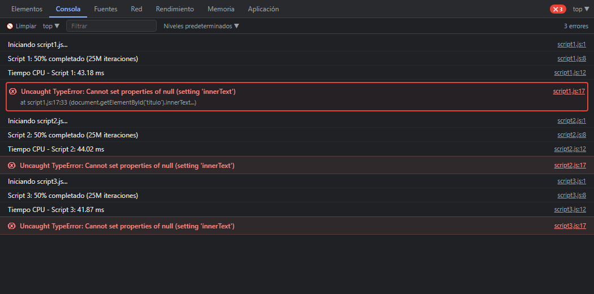
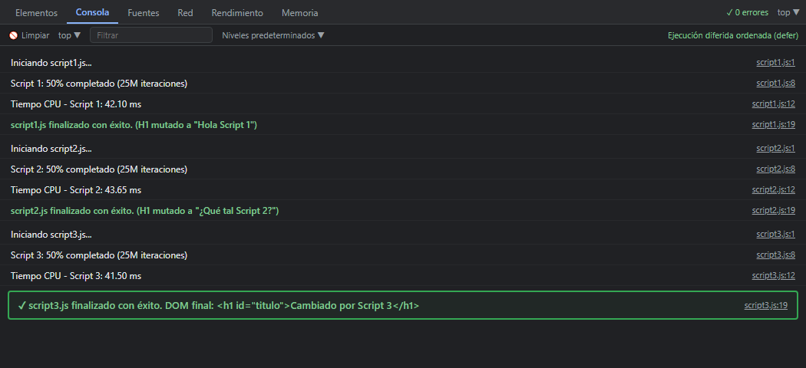

# Auditoría Técnica y Rendimiento Web

**Materia:** Desarrollo Web en Entorno Cliente.  
**Entorno auditado:** YouTube Web (SPA) | **Herramienta:** Google Chrome DevTools  

---

## Actividad 1: Laboratorio de Auditoría y Rendimiento Web

### 1. Auditoría de Red (Network): Modelo Cliente vs Servidor.

#### Evidencias capturadas
- **Documento base (HTML):** 
- **Descarga de scripts (JS):** 

#### Métricas obtenidas
| Métrica / Recurso | Documento Inicial (`Doc`) | Scripts (`JS`) |
| :--- | :--- | :--- |
| **Recurso principal** | `watch?v=...` | Bundles modulares (`base.js`, `kevlar_base_module`) |
| **Transferido por red** | ~0.3 kB (cache) / 36.2 kB inicial | 44.7 MB (sesión activa) |
| **En memoria (descomprimido)** | 1.64 MB | 64.6 MB |
| **Hitos de carga** | `DOMContentLoaded`: 11.56 s | `Load`: 12.98 s |

#### Diagnóstico: SSR vs CSR
YouTube opera bajo **CSR (Client-Side Rendering)**: el servidor entrega un cascarón HTML mínimo (~36 kB transferidos) y delega la construcción íntegra de la interfaz al navegador mediante más de 64 MB de JavaScript en memoria. Esto reduce la carga computacional del servidor y habilita transiciones dinámicas sin recarga, a expensas de exigir mayor potencia de CPU en el cliente.

---

### 2. Destripando el Motor (Performance): Fases de Ejecución en V8.

Durante una interacción en una SPA, el motor **V8** procesa el código en cuatro fases sobre el hilo principal (*Main Thread*):



```
[ Código Fuente JS ] ──► (1. Parser) ──► [ AST ] ──► (2. Intérprete Ignition) ──► [ Bytecode ]
                                                                                      │
                                                                   (3. Profiler) ─────┘
                                                                        │ (Hot Code)
                                                                        ▼
[ Desoptimización ] ◄── (Si cambian tipos) ── [ 4. Compilador TurboFan ] ──► [ Código Máquina ]
```

#### Fases de DevTools y actividad en captura (`Motor_V8.png`)
* **Parsing HTML (Análisis de HTML):** Construcción del DOM inicial y de fragmentos inyectados dinámicamente.
* **Compile Code / JIT:** V8 transforma el AST a Bytecode (*Ignition*) y compila funciones calientes a código máquina (*TurboFan*).
* **Evaluate Script / Function Call:** Bloques amarillos en el *Main Thread* ejecutando manejadores de eventos (ej. `pointermove` sobre el reproductor) y recálculos de UI.
* **Sobrecarga del perfilador (*Profiler Overhead*):** Muestreo periódico de la pila para identificar funciones de alto consumo.
* **Tareas Largas (*Long Tasks* > 50 ms):** Marcadas con triángulos rojos; saturan el hilo principal y provocan microtirones.

---

### 3. El Sandbox del Navegador en Acción (Consola).

El **Sandbox** aísla el código web del sistema operativo anfitrión bajo el principio de mínimo privilegio.

#### Prueba A: Código legítimo (Memoria interna de la pestaña)


```javascript
const a = "Bienvenidos";
console.log(a);
// Salida: Bienvenidos | Retorno: undefined
```
* **Diagnóstico:** Se ejecuta en el contexto global de la pestaña (`Window scope`) consumiendo APIs seguras sin trascender sus límites de memoria.

#### Prueba B: Violación del Sandbox (Intento de lectura del disco local)


```javascript
const r = new FileReader();
r.readAsText("C:\\Users\\LENOVO\\Desktop\\Downloads");
r.onload = function() { console.log(r.result); };
```
* **Error capturado:** `Uncaught TypeError: Failed to execute 'readAsText' on 'FileReader': parameter 1 is not of type 'Blob'.`
* **Mecanismo de seguridad activo:**
  1. **Aislamiento del sistema de archivos (*File System Isolation*):** Las APIs web no admiten rutas locales arbitrarias (`String`). `FileReader` exige una referencia legítima (`File`/`Blob`) concedida explícitamente por el usuario (mediante `<input type="file">` o *drag-and-drop*).
  2. **Defensa contra exfiltración y RCE:** Impide que scripts de terceros lean claves SSH, historiales, credenciales o modifiquen ficheros del sistema operativo en segundo plano.

---

### 4. Análisis de Bloqueo: Scripts vs Programación Tradicional.

#### Identificación del recurso crítico
 

Se auditan bundles centrales como `base.js` y módulos de infraestructura Kevlar que superan **1 MB** de código en memoria.

#### Impacto en la experiencia de usuario
| Dimensión técnica | Modelo Síncrono Tradicional | Modelo Asíncrono Orientado a Eventos |
| :--- | :--- | :--- |
| **Hilo Principal (*Main Thread*)** | Bloqueado durante descarga y compilación JIT. | Libre; tareas diferidas sin retener el renderizado. |
| **Construcción del DOM** | Interrupción total (*parser-blocking*); pantalla en blanco. | Continua; el árbol DOM se construye sin pausas. |
| **Bucle de Eventos (*Event Loop*)** | Congelado; no procesa clics ni eventos de entrada. | Fluido; despacha tareas y microtareas de usuario. |
| **Percepción UX** | Interfaz congelada (*"La página no responde"*). | Reactiva con hidratación progresiva de componentes. |

---

## Actividad 2: El Gran Duelo de la Integración (defer vs async vs modules)
  
**Entorno de pruebas:** Servidor HTTP local con 3 scripts pesados (bucle de 50 millones de iteraciones de CPU medidos con `console.time()`).

---

### 1. Matriz Comparativa de Rendimiento y Renderizado

| Escenario | Integración | Descarga JS | Ejecución | ¿Falla acceso a `#titulo`? | FCP (Pintado inicial) | Orden ejecución | Texto final en DOM |
| :---: | :--- | :--- | :--- | :---: | :---: | :---: | :--- |
| **A** | `<script>` en `<head>` | Bloqueante | Inmediata (detiene parser) | **Sí (TypeError)** | Muy tardío | 1 ➔ 2 ➔ 3 | `"Hola"` (original) |
| **B** | `<script>` antes de `</body>` | Bloqueante | Secuencial tras parsear body | **No** | Tardío | 1 ➔ 2 ➔ 3 | `"Cambiado por Script 3"` |
| **C** | `<script async>` en `<head>` | En paralelo | Inmediata al descargar | **Sí (en local / red rápida)** | Variable (carrera) | Indeterminado | Indeterminado / Error |
| **D** | `<script defer>` en `<head>` | En paralelo | Diferida tras construir el DOM | **No** | **Inmediato (óptimo)** | 1 ➔ 2 ➔ 3 | `"Cambiado por Script 3"` |
| **E** | `<script type="module">` | En paralelo | Diferida por especificación | **No** | **Inmediato (óptimo)** | 1 ➔ 2 ➔ 3 | `"Cambiado por Script 3"` |

#### Evidencia: Saturación del hilo principal y retraso del FCP (Escenario A)


---

### 2. Diagnóstico Técnico por Escenario

* **Escenario A (`<script>` síncrono en `<head>`):**  
  El analizador detiene la construcción del DOM para descargar y ejecutar los scripts. Al no haberse procesado el `<body>`, `document.getElementById('titulo')` devuelve `null`, lanzando `TypeError: Cannot set properties of null`. Pantalla en blanco prolongada.  
  

* **Escenario B (`<script>` síncrono al final del `</body>`):**  
  El elemento `<h1 id="titulo">Hola</h1>` ya existe en memoria, permitiendo la mutación secuencial (1 ➔ 2 ➔ 3). No obstante, el hilo principal se satura antes del evento `load`, demorando la interactividad.

* **Escenario C (Atributo `async` en `<head>`):**  
  Descarga concurrente pero **ejecución inmediata e interruptiva**. Provoca **condiciones de carrera (*race conditions*)** alterando el orden de dependencia, y reproduce el `TypeError` si la descarga concluye antes de que el motor parsee el `<body>`.

* **Escenario D (Atributo `defer` en `<head>`):**  
  Descarga no bloqueante en paralelo; ejecución pospuesta hasta completar el DOM, justo antes de `DOMContentLoaded`. Garantiza orden estricto (1 ➔ 2 ➔ 3), FCP inmediato y manipulación segura del DOM.  
  

* **Escenario E (Módulos ES6 `type="module"` en `<head>`):**  
  Aplica comportamiento diferido (`defer`) nativo por especificación. Introduce **ámbito modular cerrado** (no contamina `window`), ejecuta en **modo estricto** (`"use strict"`) y exige protocolo **HTTP/HTTPS** (bloqueado por directiva CORS bajo `file:///`).
